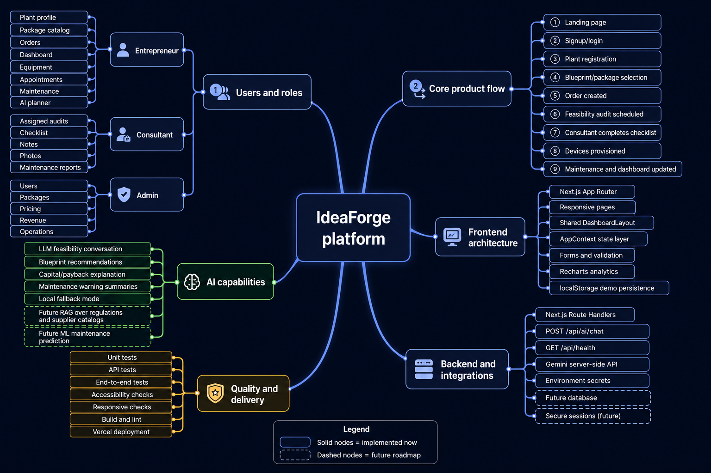

# IdeaForge architecture and product flow

The diagram summarizes the implemented prototype across six areas:

- **Users and roles:** entrepreneur, consultant, and administrator workspaces.
- **Core flow:** plant registration, package selection, order creation, audit scheduling, checklist completion, device provisioning, and dashboard updates.
- **Frontend:** Next.js App Router, responsive pages, shared layout, AppContext state, forms, validation, and Recharts.
- **Backend integrations:** server-side Route Handlers, Gemini, environment secrets, and health monitoring.
- **AI capabilities:** LLM feasibility conversation, package recommendations, payback explanations, maintenance summaries, and a local fallback.
- **Quality and delivery:** unit/API tests, manual responsive/accessibility checks, lint, build, and Vercel deployment.

Solid nodes represent current implementation. Dashed nodes represent the roadmap: RAG over approved regulations and supplier catalogs, learned maintenance prediction, a hosted database, and secure production sessions.
